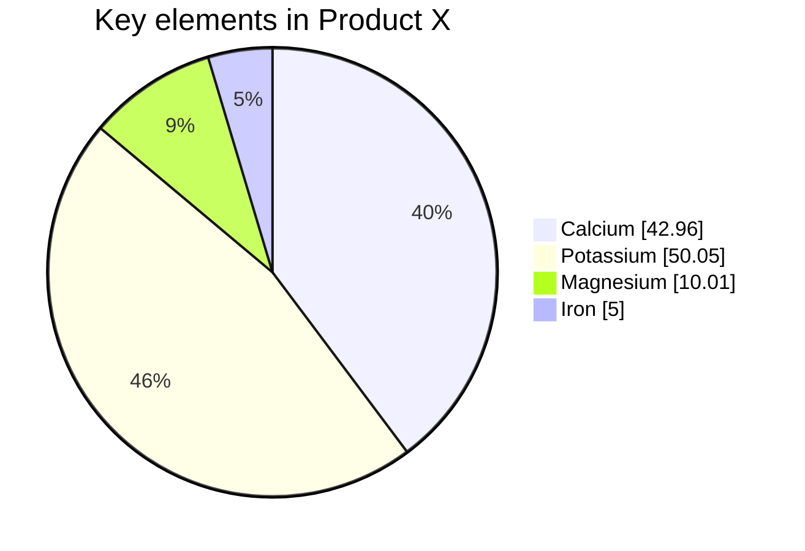

---
{"dg-publish":true,"permalink":"/formatting/"}
---


# Markdown heading 1?
## Heading 2
### Heading 3
#### Heading 4
##### Heading 5
###### Heading 6
~~Strikethrough~~
$$
\frac{1}{2}
$$
# Callouts
> [!note] Note

> [!abstract] Abstract
> Aliases: summary, tldr

> [!Info] Info

> [!todo] To-do

> [!tip] Tip
> Aliases: hint, important

> [!success] Success
> Aliases: check, done

> [!question] Question
> Aliases: help, faq

> [!warning] Warning
> Aliases: caution, attention

> [!failure] Failure
> Aliases: fail, missing

> [!Danger] Danger
> Aliases: error

> [!bug] Bug

> [!example] Example

> [!quote]- Quote
> Aliases: cite


# Mermaid things


> [!info] Seed:1
> ```mermaid
> pie showData
>     title Key elements in Product X
> 	"Calcium" : 42.96
> 	"Potassium" : 50.05
> 	"Magnesium" : 10.01
> 	"Iron" :  5
> ```

# Latex testing
## Bar charts
$$
\documentclass[varwidth=true, border=2pt]{standalone}

\usepackage{bchart}

\begin{document}
    \begin{bchart}[step=2,max=10]
        \bcbar{3.4}
            \smallskip
        \bcbar{5.6}
            \medskip
        \bcbar{7.2}
            \bigskip
        \bcbar{9.9}
    \end{bchart}
\end{document}
$$$